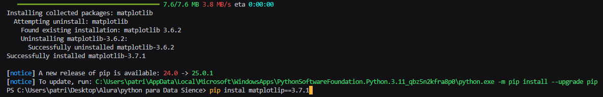
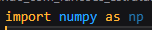
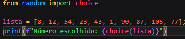
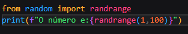
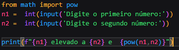
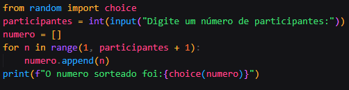
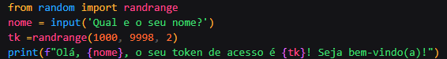

<h1> Desafios Alura </h1>

<h3> 1. Escreva um código para instalar a versão 3.7.1 da biblioteca matplotlib.</h3>

<h3>2. Escreva um código para importar a biblioteca numpy com o alias np.</h3>

<h3>3. Crie um programa que leia a seguinte lista de números e escolha um número desta aleatoriamente. 
lista = [8, 12, 54, 23, 43, 1, 90, 87, 105, 77]</h3>

<h3>4. Crie um programa que sorteia, aleatoriamente, um número inteiro positivo menor que 100. Dica: use a função randrange() da biblioteca random. Essa função recebe como parâmetro o valor limite para a escolha aleatória ou um intervalo se passado o limite mínimo e máximo. Por exemplo, randrange(5) gera valores inteiros menores que 5.</h3>

<h3>5. Crie um programa que solicite à pessoa usuária digitar dois números inteiros e calcular a potência do 1º número elevado ao 2º.</h3>

<h3>6. Um programa deve ser escrito para sortear uma pessoa seguidora de uma rede social para ganhar um prêmio. A lista de participantes é numerada e devemos escolher aleatoriamente um número de acordo com a quantidade de participantes. Peça à pessoa usuária para fornecer o número de participantes do sorteio e devolva para ela o número sorteado.</h3>

<h3>7.  Você recebeu uma demanda para gerar números de token para acessar o aplicativo de uma empresa. O token precisa ser par e variar de 1000 até 9998. Escreva um código que solicita à pessoa usuária o seu nome e exibe uma mensagem junto a esse token gerado aleatoriamente.</h3>

