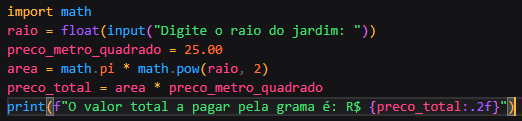

<h1> Desafios Alura </h1>

<h3> 1. Escreva um código para instalar a versão 3.7.1 da biblioteca matplotlib.</h3>

<h3>2. Escreva um código para importar a biblioteca numpy com o alias np.</h3>

<h3>3. Crie um programa que leia a seguinte lista de números e escolha um número desta aleatoriamente. 
lista = [8, 12, 54, 23, 43, 1, 90, 87, 105, 77]</h3>

<h3>4. Crie um programa que sorteia, aleatoriamente, um número inteiro positivo menor que 100. Dica: use a função randrange() da biblioteca random. Essa função recebe como parâmetro o valor limite para a escolha aleatória ou um intervalo se passado o limite mínimo e máximo. Por exemplo, randrange(5) gera valores inteiros menores que 5.</h3>

<h3>5. Crie um programa que solicite à pessoa usuária digitar dois números inteiros e calcular a potência do 1º número elevado ao 2º.</h3>

<h3> 6.Um programa deve ser escrito para sortear uma pessoa seguidora de uma rede social para ganhar um prêmio. A lista de participantes é numerada e devemos escolher aleatoriamente um número de acordo com a quantidade de participantes. Peça à pessoa usuária para fornecer o número de participantes do sorteio e devolva para ela o número sorteado.</h3>

<h3>7 Você recebeu uma demanda para gerar números de token para acessar o aplicativo de uma empresa. O token precisa ser par e variar de 1000 até 9998. Escreva um código que solicita à pessoa usuária o seu nome e exibe uma mensagem junto a esse token gerado aleatoriamente. 
"Olá, [nome], o seu token de acesso é [token]! Seja bem-vindo(a)!"</h3>

<h3>8 Para diversificar e atrair novos(as) clientes, uma lanchonete criou um item misterioso em seu cardápio chamado "salada de frutas surpresa". Neste item, são escolhidas aleatoriamente 3 frutas de uma lista de 12 para compor a salada de frutas da pessoa cliente.</h3>

<h3>9. Você recebeu um desafio de calcular a raiz quadrada de uma lista de números, identificando quais resultaram em um número inteiro. A lista é a seguinte:
numeros = [2, 8, 15, 23, 91, 112, 256]  No final, informe quais números possuem raízes inteiras e seus respectivos valores.

Dica: use a comparação entre a divisão inteira (//) da raiz por 1 com o valor da raiz para verificar se o número é inteiro.Saída:

1.5 é inteiro? : False
2 é inteiro? : True</h3>
 

 <h3>10. Faça um programa para uma loja que vende grama para jardins. Essa loja trabalha com jardins circulares e o preço do metro quadrado da grama é de R$ 25,00. Peça à pessoa usuária o raio da área circular e devolva o valor em reais do quanto precisará pagar.

Dica: use a variável pi e o método pow() da biblioteca math. O cálculo da área de um círculo é de: A = π*r^2 (lê-se pi vezes raio ao quadrado).

Caso precise de ajuda, opções de solução das atividades estão disponíveis na seção “Opinião da pessoa instrutora”.</h3>

